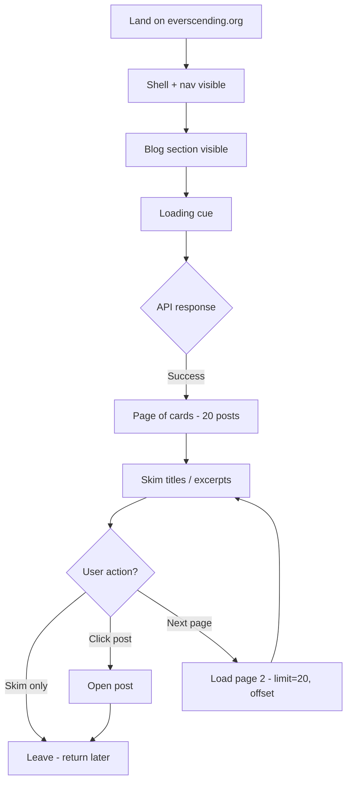
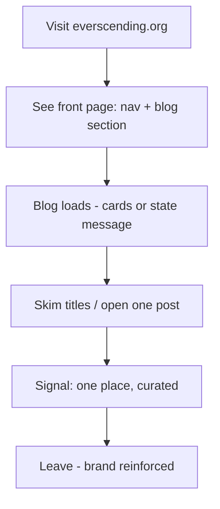

# UX Design Specification everscending.org

**Author:** Jordan
**Date:** 2026-02-19

---

## Executive Summary

### Project Vision

everscending.org is expanding from a portfolio site into a **single focal point** for people interested in AI (LLMs, agents, breakthroughs) and consciousness/philosophy. A blog on the front page will aggregate external links and posts (with or without commentary) and support original short posts, so casual readers have one curated place to skim instead of hunting across many sources. The blog is powered by SonicJS (headless CMS), with environment-specific API bases for local, develop, and production. Success is readers coming back and having one URL to share; for employers/clients, the blog reinforces your professional brand as part of the same site.

### Target Users

- **Primary: Casual readers** interested in AI + consciousness/philosophy who want one place to skim curated content, don’t want to jump between many sites, and whose “aha” moment is “I don’t have to hunt across 10 sites.”
- **Secondary: Employers / clients** evaluating you (hire, collab, referral) who see the blog as part of your professional brand and value the signal of interests and curation in one coherent destination.

### Key Design Challenges

- **Coherent integration:** The blog must feel like one experience with the existing everscending.org layout and nav (same container, typography, spacing, breakpoints) so portfolio and blog read as a single destination.
- **Graceful degradation:** Empty state (no posts) and error state (API down / network failure) must be clear and non-breaking—no infinite spin or dead-ends; the rest of the site (nav, other content) stays usable.
- **Scannable, low-friction reading:** Support quick skimming (paginated cards: title, link, optional excerpt/commentary) and optional deeper reading without adding friction for the “skim and return” pattern.

### Design Opportunities

- **One-URL clarity:** Use the front-page blog placement and consistent layout to reinforce “one place to check” and make the value proposition obvious at a glance.
- **Trust and curation:** Use structure and tone so the blog reads as a single trusted filter (you) rather than algorithmic noise—supporting return visits and shareability.
- **Accessibility and performance:** Align with existing site baseline (semantic HTML, focus order, contrast; non-blocking load so shell/nav appear first, then blog) so the new section doesn’t regress the current experience.

## Core User Experience

### Defining Experience

The core experience is **land on the front page → see the blog → skim posts**. The one thing that must be right is **immediate, scannable access** to the curated feed: paginated cards with title, link, and optional excerpt/commentary so the “one place to check” value is obvious. Opening a post (in-app or external) is secondary; the primary loop is skim-first, optional deep read.

### Platform Strategy

- **Web only** (existing SPA: React, Vite). Same deployment and host rules (localhost, develop, production).
- **Modern evergreen browsers** (Chrome, Firefox, Safari, Edge); no legacy IE. Mouse/keyboard and touch; blog cards tappable and readable on small viewports using existing breakpoints.
- **No offline** in MVP. No new platform constraints beyond current site (env-based API, non-blocking blog load).

### Effortless Interactions

- **Zero gate:** Blog is part of the normal front-page experience—no login or extra step.
- **Non-blocking load:** Shell and nav appear first; blog fills in when the API responds (or shows loading/empty/error). No “stuck” or blank blog area.
- **Empty and error states:** “No posts yet” or a clear “can’t load posts” message; rest of site (nav, portfolio) stays usable so the experience never feels broken.
- **Scannable cards:** One clear paginated card layout so skimming is the default, with minimal cognitive load.

### Critical Success Moments

- **First load:** “The blog is right here on the front page” — no hunting for the feed.
- **Skim moment:** “I can see what’s new in one place” — titles/links (and optional excerpts) support quick decisions.
- **Return intention:** “I’ll come back here next time” — one URL, one coherent destination.
- **Employer/client:** “Portfolio and blog are one story” — single brand, one URL.
- **Failure case:** If the API fails or there are no posts, the user sees a clear state and can still use the rest of the site (no dead-end or cryptic error).

### Experience Principles

1. **One coherent destination** — Blog and portfolio share layout, nav, and tone so everscending.org feels like a single place.
2. **Graceful degradation** — Empty and error states are explicit and non-blocking; the shell and rest of the site never appear broken.
3. **Scannable first** — Design for skim (paginated cards, clear hierarchy) so the core action is effortless; deep read is optional.
4. **Non-blocking and predictable** — Shell/nav first, then blog; no regression in perceived performance or clarity.

## Desired Emotional Response

### Primary Emotional Goals

- **Oriented and in control** — "I know where I am and what I can do." One place, one feed, no hunting.
- **Relieved / unburdened** — "I don't have to check 10 sites." Curation does the work; skimming is enough.
- **Trusting** — "This is a single human filter I can rely on." Not algorithmic noise; one curator.
- **Willing to return** — "I'll come back here next time." Low commitment, clear value, one URL.

### Emotional Journey Mapping

- **Discovery:** Curious but not lost — blog is visible on the front page; "this is the feed" is obvious.
- **Core skim:** Calm and efficient — scanning titles/links feels quick and sufficient; no pressure to read everything.
- **After skimming:** Satisfied and updated — "I've seen what's new"; optional "I'll open one or two" without guilt.
- **When something goes wrong:** Reassured, not stuck — empty or error state is clear; rest of site still works; no confusion or blame.
- **Return visit:** Familiar and low-friction — same URL, same layout; "I know where to go."

### Micro-Emotions

- **Confidence over confusion** — Layout and states (loading, empty, error) are clear so users never wonder if the site is broken.
- **Trust over skepticism** — One curator, consistent voice and structure; no "content farm" or opaque algorithm.
- **Calm over anxiety** — No infinite spinners or dead-ends; errors don't block the whole experience.
- **Accomplishment over frustration** — "I skimmed the feed" or "I found something to read" feels sufficient.

### Design Implications

- **Oriented / in control** → One clear blog section on the front page; same nav and layout as the rest of the site; consistent hierarchy (paginated cards).
- **Relieved / unburdened** → Scannable list first; optional excerpts; no "read more" pressure; fast, non-blocking load.
- **Trust** → Consistent typography and tone; human curation obvious (e.g. optional commentary); no dark patterns or clutter.
- **Reassured when things fail** → Explicit empty state ("No posts yet") and error state ("Couldn't load posts"); rest of page and nav always usable.
- **Willing to return** → Predictable structure; one URL to bookmark/share; no gates or surprises.

### Emotional Design Principles

1. **Clarity over cleverness** — States (loading, empty, error, success) are obvious; no mystery or ambiguity.
2. **Calm over urgency** — Design supports skimming and optional deep read; no FOMO or "you must read this."
3. **Trust through consistency** — Same visual and interaction language as the rest of everscending.org so the blog feels part of one person's place.
4. **Grace under failure** — Errors and empty states feel informative and recoverable, not alarming or punishing.

## UX Pattern Analysis & Inspiration

### Inspiring Products Analysis

*(Refine with 2–3 apps your readers love; for now, reference patterns from familiar product types.)*

**Reference patterns from curated-content and reader experiences:**

- **Newsletters / minimal readers (e.g. Substack, Hey World, personal blogs):** Single feed, clear list (title + optional blurb), one primary action (open/read). Low chrome; content first. Fits "one place to skim."
- **Dev / indie blogs and link blogs:** Chronological list or cards, title + link + optional commentary. Often dark or minimal; typography and spacing carry the design. Aligns with everscending.org's "curated filter" feel.
- **Reader apps (e.g. Reeder, NetNewsWire):** Scannable list, skim model, clear empty and error states. Takeaways: non-blocking load, explicit states, keyboard-friendly list.

### Transferable UX Patterns

- **Scannable paginated cards** — One card per post (title, link, optional excerpt/commentary); pagination for bounded pages. Supports skim-first and "see what's new."
- **Clear hierarchy** — Section heading (e.g. "Blog" or "Latest") then list; same container/typography as rest of site. Reinforces one coherent destination.
- **Explicit loading, empty, and error states** — Brief loading cue; "No posts yet" when empty; "Couldn't load posts" with nav still usable when API fails. Supports trust and calm.
- **Minimal chrome, content first** — No extra dashboards for a single feed; blog is a section on the front page. Fits calm, efficient skim.
- **Consistent layout and breakpoints** — Reuse existing everscending.org container and responsive rules so the blog feels native.

### Anti-Patterns to Avoid

- **Gate or paywall before the feed** — Blog is part of the normal front-page experience; no login or modal to see the feed.
- **Infinite scroll with no structure** — Prefer a bounded list (or pagination later) so "I've seen what's new" is clear.
- **Cryptic or missing error/empty states** — No infinite spinner, blank area, or generic "Something went wrong" without context; rest of site must stay usable.
- **Blocking load** — Don't block shell/nav on the blog API; show shell first, then fill the blog.
- **Visual language that clashes with the rest of the site** — Same typography, spacing, and tone as everscending.org.

### Design Inspiration Strategy

**Adopt:** Scannable paginated cards; explicit loading, empty, and error states; minimal chrome and content-first layout.

**Adapt:** List/cards pattern to existing everscending.org layout (container, typography, breakpoints, dark theme). Reader-app clarity applied to a single front-page section.

**Avoid:** Gates, infinite scroll without structure, blocking load, and anything that breaks clarity or coherence with the rest of the site.

## Design System Foundation

### 1.1 Design System Choice

**Extend the existing everscending.org design system** (custom CSS, no new UI framework). The blog will use the same foundation as the rest of the site: global tokens and layout in `App.css`, component-scoped styles, and existing patterns (e.g. `outer-container`, `inner-container`, typography, spacing, breakpoints). No Material, Ant, Chakra, or Tailwind UI; the current "custom" system is the design system.

### Rationale for Selection

- **Coherence:** The spec calls for one coherent destination; reusing the same tokens and layout keeps the blog visually and structurally part of everscending.org.
- **Brownfield:** The site already has a defined look (dark theme, accent colors, Optima, layout). Introducing a full third-party design system would conflict with that and add unnecessary weight.
- **Scope:** The blog is one new section (paginated cards + loading/empty/error). Extending the existing system is enough; a large component library isn't required.
- **Maintenance:** One styling approach (CSS variables + component CSS) keeps the codebase simple and avoids mixing design systems.

### Implementation Approach

- **Tokens:** Use existing `App.css` variables (e.g. `--primary-bg`, `--primary-text`, `--accent-orange`, `--link-color`, layout containers). Add blog-specific tokens only if needed (e.g. a subtle list/card variant), and keep them consistent with the palette.
- **Layout:** Reuse `outer-container` / `inner-container` (or equivalent) so the blog section sits in the same content column as the rest of the site.
- **Components:** Add a small set of blog components (e.g. blog section wrapper, post cards + pagination, loading state, empty state, error state) that use the same typography, spacing, and link styles as the rest of the site.
- **Responsive:** Use the same breakpoints and patterns as the rest of everscending.org (e.g. existing mobile rules); no new breakpoint system for the blog.

### Customization Strategy

- **No theme swap:** Keep the current dark theme and accent colors; the blog does not introduce a new theme.
- **Blog-specific tweaks:** Limit to what's needed for hierarchy and scanability (e.g. list/card spacing, optional excerpt styling). All type and color choices should feel like the rest of the site.
- **Accessibility:** Follow the same baseline as the rest of the site (semantic HTML, focus order, contrast); no new a11y framework, just consistent application of existing patterns.

## 2. Core User Experience

### 2.1 Defining Experience

**"Skim the curated feed on the front page."** That's the one thing to nail: the user lands, sees the blog section immediately, and can scan a page of cards (title, link, optional excerpt/commentary) and move between pages via pagination—without hunting or extra steps. Opening a post is optional; the defining experience is *seeing what's new in one place*. If we get that right, return visits and "one URL to share" follow.

### 2.2 User Mental Model

- **How they solve it today:** They check multiple sites, newsletters, or feeds and mentally merge them. They're used to feeds, lists, and "latest first."
- **Expectation:** A single list or feed of items (like a blog roll or newsletter digest). One place, chronological or reverse-chron, with clear titles and links.
- **Confusion risks:** Hidden or buried blog; unclear what's a post vs. nav; empty area with no explanation; spinner that never resolves. The mental model is "feed/list"; the UI should match that immediately.

### 2.3 Success Criteria

- **"This just works":** Blog section is visible on first load; list appears (or a clear loading/empty/error state); no gate, no dead-end.
- **Feeling of success:** "I've seen what's new" after a quick scan; optional "I opened one or two" without friction.
- **Feedback:** List renders with recognizable items (title, link); loading state is brief and replaced by content or explicit empty/error; no silent failure.
- **Speed:** Shell and nav appear first; blog fills in soon after; skimming feels instant (no blocking, no heavy interaction).
- **Automatic:** Correct content for the environment (API); no user config. User just lands and skims.

### 2.4 Novel UX Patterns

**Established patterns.** The core experience is a familiar feed: section heading, then a set of cards with pagination. No new interaction paradigm. The "novel" part is the *positioning* (one curated place for AI + consciousness) and *coherence* with the rest of everscending.org, not a new gesture or flow. Adopt: clear section heading, paginated cards, one link per post, explicit loading/empty/error. No user education needed beyond "the blog is here on the front page."

### 2.5 Experience Mechanics

1. **Initiation:** User lands on everscending.org (shared link, direct, or search). The front page loads; blog is a visible section (e.g. "Blog" or "Latest") in the same scroll as nav and any hero/content.
2. **Interaction:** User scans the cards on the current page. Each card: title (and optional excerpt/commentary). Primary action: click through to post (in-app or external). Pagination to load more pages. No required input; scanning is the main interaction.
3. **Feedback:** While loading: brief loading cue (e.g. placeholder or message). On success: list of posts. On empty: "No posts yet" (or equivalent). On error: "Couldn't load posts" (or equivalent); nav and rest of site stay usable.
4. **Completion:** Success = user has skimmed the list and optionally opened one or more posts. No formal "done" state; completion is "I've seen what's new" and optionally "I'll come back later."

## Visual Design Foundation

### Color System

**Use the existing everscending.org palette** (document as the single source of truth for the blog):

- **Background:** `--primary-bg: #101010` (dark) for main surfaces.
- **Text:** `--primary-text: #ebebeb` for body and headings.
- **Accents:** `--accent-orange: #e9a23e`, `--accent-yellow: #fdc679` for emphasis, links, or highlights (e.g. hover, key labels).
- **Links:** `--link-color: #d0d0d0`, `--link-hover-color: #fff` (or accent) so links are clear and consistent with the rest of the site.

**Semantic use for the blog:** Use primary text for titles and excerpts; link color for post links; accent for hover or "Latest" / section emphasis if desired. No new palette; blog uses the same CSS variables as the rest of the site. **Accessibility:** Keep contrast at or above the existing site baseline (WCAG AA where applicable); no regression for the blog section.

### Typography System

**Existing site typography:**

- **Primary typeface:** Optima (with system fallback) for the main site and blog.
- **Hierarchy:** Same as rest of site — section heading (e.g. "Blog" / "Latest"), then list; post titles and optional excerpts use the same scale and weight as comparable content elsewhere.
- **Readability:** Body/excerpt size and line height consistent with current site; no smaller or denser type for the blog.

**Blog-specific:** Post titles as clear, scannable headings (e.g. same or one step down from section heading); excerpts in body style. No new typefaces; Optima and existing scale define the typography system.

### Spacing & Layout Foundation

**Reuse existing layout:**

- **Containers:** Same `outer-container` / `inner-container` (or equivalent) so the blog sits in the same content column and max-width as the rest of everscending.org.
- **Spacing:** Same margins and padding patterns as other sections (e.g. section margin, list item spacing). No new spacing scale; match current section and list spacing.
- **Grid:** No new grid; blog is a single-column block within the existing layout. List or cards use consistent vertical rhythm (e.g. gap between items) that matches the rest of the site.
- **Density:** Align with current site — enough space for scanability without feeling sparse or cramped.

### Accessibility Considerations

- **Contrast:** Use existing `--primary-text` on `--primary-bg` and existing link colors; ensure link hover state meets the same contrast as the rest of the site.
- **Structure:** Blog section with a visible heading (e.g. "Blog" or "Latest"); list marked up as a list (`ul`/`ol` or list-like structure); one focusable link per post so keyboard and screen-reader users can move through the feed.
- **States:** Loading, empty, and error states are visible and announced (e.g. live region or heading) so assistive tech users get the same information as sighted users.
- **Focus:** Focus order follows reading order (nav → blog section → post links); focus indicators consistent with the rest of the site. No new a11y framework; apply the same baseline as everscending.org today.

## Design Direction Decision

### Design Directions Explored

**Single primary direction: extend existing everscending.org.** The only layout choice was feed presentation: list vs. cards. **Chosen: paginated cards.**

### Chosen Direction

**Extend existing everscending.org** with a **paginated card layout** for the blog. Posts are shown as cards (title, link, optional excerpt/commentary) with pagination (e.g. next/previous or page numbers) so users see a bounded set per page—no infinite scroll. Same visual foundation (colors, type, spacing, containers) as the rest of the site.

### Design Rationale

- **Coherence:** One URL, one look — blog and portfolio feel like the same product.
- **Brownfield:** The site already has a defined look; reusing it keeps the blog native.
- **Cards:** Card layout supports scanability and clear per-post hierarchy; fits "one place to skim."
- **Pagination:** Bounded pages align with "I've seen what's new" and our anti-pattern of avoiding infinite scroll without structure; also keeps pages predictable for return visits and accessibility.

### Implementation Approach

- **Visual:** Apply existing CSS variables and component patterns; add a blog section and a **card grid** (or list of cards) using the same tokens. Each card: title, link, optional excerpt/commentary.
- **Pagination:** Provide controls (e.g. "Next" / "Previous" or page numbers) and a finite set of posts per page. **Default page size: 20** — passed as the `limit` argument to the posts API. Loading/empty/error states apply to the current page or the section as a whole per PRD.
- **Responsive:** Cards readable and tappable on small viewports using existing breakpoints (e.g. single column on narrow, grid on wider).

## User Journey Flows

### 1. Casual reader – success path

**Goal:** Land on everscending.org, see the blog, skim a page of cards (and optionally open a post or go to the next page), and leave with "this is the one place I'll check."

**Flow:** Entry (shared link, search, or direct) → Front page loads (shell + nav first) → Blog section visible → Loading cue → API returns posts → Page of cards (default 20, `limit=20`) → User skims titles/links/excerpts → Optional: click post (in-app or external) and/or use pagination (next/previous) → User leaves with return intention.



**Entry:** Front page (home route). **Success:** User sees the feed and can skim (and optionally open a post or change page) without confusion. **Feedback:** Loading → list of cards or empty state; pagination shows there is more when applicable.

### 2. Casual reader – edge case (empty or API error)

**Goal:** When there are no posts or the API fails, the user sees a clear state (empty or error), the rest of the site stays usable, and they don't think the site is broken.

**Flow:** Entry → Front page → Blog section visible → Loading cue → API fails or returns empty → Show "No posts yet" or "Couldn't load posts" (no infinite spinner) → Nav and rest of page (e.g. portfolio) still usable → User can leave or retry later (e.g. refresh).

```mermaid
flowchart TD
    A[Land on everscending.org] --> B[Shell + nav visible]
    B --> C[Blog section visible]
    C --> D[Loading cue]
    D --> E{API response?}
    E -->|Empty| F[Show "No posts yet"]
    E -->|Error / timeout| G[Show "Couldn't load posts"]
    F --> H[Rest of site usable]
    G --> H
    H --> I[User: use nav, leave, or retry later]
```

**Entry:** Same as success path. **Decision:** No user choice in the failure path; the app decides empty vs. error and shows the right message. **Recovery:** Clear copy + intact nav and content; no dead-end.

### 3. Employer / client – brand viewer

**Goal:** Evaluate you (hire/collab/referral); see blog and portfolio as one coherent story and get the signal "curates and writes about this space in one place."

**Flow:** Entry (direct or search) → Front page → Blog section visible alongside nav/portfolio → (Loading → cards or empty/error as above) → Skim a few titles or open one post → Form impression → Leave; blog reinforces brand.



**Entry:** Same front page. **Success:** Blog and rest of site feel like one experience; no separate "blog app" feel. **Efficiency:** No extra steps; blog is on the front page, no gate.

### Journey patterns

- **Entry:** All journeys start on the front page (home route); blog is one section, no separate blog route required for MVP.
- **Feedback:** Same pattern for all: loading → then content (cards), empty, or error. No silent failure.
- **Decision:** User only chooses whether to skim, open a post, or use pagination; no login or other gates.
- **Recovery:** Empty and error paths show a clear message and keep nav and rest of site usable; user can refresh or leave.

### Flow optimization principles

1. **Short path to value:** First paint = shell + nav; blog appears as soon as the API responds (or shows empty/error). No blocking; user can skim as soon as cards render.
2. **Low cognitive load:** One blog section, one page of cards at a time, clear pagination. No competing calls-to-action for the "skim and return" goal.
3. **Clear feedback:** Loading, then either cards, "No posts yet," or "Couldn't load posts." Pagination indicates more content when applicable.
4. **Graceful failure:** Empty and error are explicit; rest of site remains usable so the user never feels stuck.
5. **Consistent journey:** Same layout and behavior for casual readers and employer/clients; one URL, one experience.

## Component Strategy

### Design System Components

**Foundation (existing everscending.org):** No separate component library. The site already provides layout and tokens we reuse:

- **Layout:** `outer-container`, `inner-container` (or equivalent) for content width and alignment.
- **Typography:** Headings and body via existing CSS variables and Optima; link styles from `--link-color` / `--link-hover-color`.
- **Spacing:** Existing section and list spacing; no new spacing scale.
- **Links and text:** Standard `<a>`, headings, and paragraphs; no custom "button" or "card" primitives beyond what we add for the blog.

**Gap:** The blog needs dedicated components (section wrapper, card, states, pagination) that sit on top of this foundation.

### Custom Components

#### Blog section (wrapper)

- **Purpose:** Wraps the blog block on the front page; provides a single landmark and consistent spacing with the rest of the site.
- **Usage:** One per page; wraps heading, cards grid, and pagination (or loading/empty/error).
- **Anatomy:** Section container, optional "Blog" / "Latest" heading, slot for content (cards, loading, empty, or error).
- **States:** Default (with content or states inside). No separate wrapper state.
- **Accessibility:** `<section>` with `aria-label` (e.g. "Blog"); heading level consistent with the rest of the site (e.g. `h2`).

#### Post card

- **Purpose:** One card per post: title, link, optional excerpt/commentary.
- **Usage:** Rendered in a grid/list for each post on the current page.
- **Anatomy:** Block or link wrapper; title (link); optional excerpt/commentary.
- **States:** Default, hover (link highlight per site styles), focus (visible focus ring).
- **Accessibility:** One focusable link per card (title or whole card); semantic structure (e.g. `article` or list item); no redundant links for the same target.

#### Loading state

- **Purpose:** Shown while the posts API request is in flight.
- **Usage:** Replaces the cards area until the API responds.
- **Anatomy:** Placeholder (e.g. message "Loading…" or minimal skeleton) inside the blog section.
- **States:** Single "loading" state; replaced by content, empty, or error.
- **Accessibility:** Live region or aria-busy so assistive tech knows content is loading; no infinite spinner without a message.

#### Empty state

- **Purpose:** Shown when the API returns no posts.
- **Usage:** Replaces the cards area when the list is empty.
- **Anatomy:** Short message (e.g. "No posts yet"); same section container so layout doesn't collapse.
- **States:** Single "empty" state.
- **Accessibility:** Message readable by screen readers; no misleading "list" semantics when there are no items.

#### Error state

- **Purpose:** Shown when the posts API request fails (network error, timeout, non-2xx).
- **Usage:** Replaces the cards area; rest of page (nav, other content) stays usable.
- **Anatomy:** Short message (e.g. "Couldn't load posts"); optional retry (e.g. link or button) if desired in MVP.
- **States:** Single "error" state.
- **Accessibility:** Message and any retry control focusable and announced; no dead-end.

#### Pagination controls

- **Purpose:** Let the user move between pages of cards (e.g. next/previous or page numbers).
- **Usage:** Rendered below the cards when there is more than one page (or when total count/API supports it).
- **Anatomy:** "Previous" and "Next" (and optionally page numbers); current page indicated.
- **States:** Default, hover, focus; "Previous" / "Next" disabled on first/last page when applicable.
- **Accessibility:** Links or buttons with clear labels (e.g. "Previous page", "Next page"); current page indicated for screen readers; keyboard operable.

### Component Implementation Strategy

- **Tokens:** All custom components use existing CSS variables (colors, typography, spacing) and layout containers.
- **Reuse:** Reuse existing link and heading styles; cards and states are the only new visual patterns.
- **Consistency:** Same breakpoints and responsive behavior as the rest of the site (e.g. card grid stacks on narrow viewports).
- **Accessibility:** Semantic HTML, one focusable link per post, clear loading/empty/error copy, and accessible pagination.

### Implementation Roadmap

- **Phase 1 – Core:** Blog section wrapper, post card, loading state, empty state, error state. Required for all three user journeys (success, edge case, brand viewer).
- **Phase 2 – Pagination:** Pagination controls and wiring to API (`limit=20`, offset or cursor). Required for success path when there are more than 20 posts.
- **Phase 3 – Polish (optional):** Refinements to card hover/focus, skeleton loading, or retry in error state if desired.

## UX Consistency Patterns

### Button Hierarchy

**MVP scope:** The blog does not introduce new primary/secondary button patterns. Actions are link-based (post title, "Next" / "Previous" pagination). Use existing site link styles; pagination can be links or button-styled links. No form submit or modal primary action in blog MVP. **Guideline:** Any future button (e.g. retry) should follow one level of emphasis (single primary per context) and reuse `--link-color` / `--accent-*` so the blog doesn't introduce a new hierarchy.

### Feedback Patterns

- **Loading:** Brief, in-place feedback in the blog section (e.g. "Loading…" or minimal skeleton). No full-page loader. Non-blocking; shell and nav visible.
- **Success:** Content appears (cards). No toast or banner for "posts loaded"; the presence of cards is the feedback.
- **Empty:** In-place message ("No posts yet"). Same section container; rest of site unchanged.
- **Error:** In-place message ("Couldn't load posts"). Optional retry control. Rest of site usable. No generic "Something went wrong" without context.
- **Accessibility:** Loading/empty/error announced (e.g. live region or heading); no reliance on color alone.

### Form Patterns

**MVP scope:** No forms in the blog (read-only feed). If retry is added, a single control (link or button) is sufficient; no validation or multi-field form patterns needed for MVP.

### Navigation Patterns

- **Site nav:** Unchanged; blog is content on the front page, not a nav item (unless you add it to the nav later). No new global nav pattern for the blog.
- **In-blog:** Pagination only. "Previous" / "Next" (and optionally page numbers). Clear labels; current page indicated. No tabs or filters in MVP.
- **Links:** Post title/link opens in same tab or new tab per API/content (external vs. in-app). Use existing link styles; focus visible.

### Additional Patterns

- **Links as actions:** Primary action per card = open post (link). Use existing `--link-color` / hover. No card "button" needed unless you want explicit CTA styling.
- **Empty and error states:** Always in-place, inside the blog section; same container so layout doesn't jump. Message + optional single action (e.g. retry).
- **Cards:** One card per post; consistent spacing and typography; no nested buttons in MVP. Touch target for the link should meet minimum size on small viewports (existing breakpoints).

## Responsive Design & Accessibility

### Responsive Strategy

**Align with existing everscending.org.** The blog is one section on the front page and uses the same layout and breakpoints as the rest of the site.

- **Desktop:** Same content width and spacing as current site; card grid uses available width within the existing container (e.g. multi-column grid where the layout allows).
- **Tablet:** Same breakpoints and behavior as the rest of the site; cards remain tappable and readable; no separate tablet-only layout.
- **Mobile:** Blog section and cards follow existing mobile rules (e.g. single column, same margins/padding); no new breakpoints. Critical content: section heading, cards (title, link, optional excerpt), then pagination.

No separate desktop/tablet/mobile strategies; one responsive system shared with everscending.org.

### Breakpoint Strategy

**Reuse existing site breakpoints.** Do not introduce new breakpoints for the blog. The spec and AGENTS.md reference existing rules (e.g. `@media (max-width: 700px)` for Gradio); the blog should use the same or the main site breakpoint set so the card grid and spacing adapt with the rest of the page. **Approach:** Match current everscending.org (e.g. mobile-first if the site is mobile-first); no custom breakpoints for the blog only.

### Accessibility Strategy

**Target: WCAG 2.x Level AA** in line with the rest of everscending.org (no regression).

- **Contrast:** Use existing `--primary-text` on `--primary-bg` and existing link colors; ensure link hover and focus meet the same contrast as the rest of the site (e.g. 4.5:1 for normal text).
- **Keyboard:** Blog section and all interactive elements (post links, pagination) reachable and operable by keyboard; focus order: nav → blog heading → cards (one focusable link per post) → pagination.
- **Screen readers:** Semantic structure (e.g. `<section>`, heading, list or list-like structure for cards); loading, empty, and error states announced (e.g. live region or heading); pagination current page and "Previous"/"Next" clearly labeled.
- **Touch targets:** Link and pagination controls meet minimum touch target size (e.g. 44×44px or equivalent) on small viewports, consistent with the rest of the site.
- **Focus:** Visible focus indicators on post links and pagination; consistent with existing site focus style.

No new a11y framework; apply the same baseline as everscending.org.

### Testing Strategy

- **Responsive:** Test blog section and cards at the same viewport widths used for the rest of the site (e.g. narrow mobile, tablet, desktop); ensure no horizontal overflow and cards remain readable/tappable.
- **Accessibility:** Run automated a11y checks on the home page (including the blog block); test keyboard-only navigation through blog and pagination; test with one screen reader (e.g. VoiceOver or NVDA) for loading, empty, error, and pagination.
- **Cross-browser:** Test in the same browsers as the rest of the site (Chrome, Firefox, Safari, Edge).

### Implementation Guidelines

- **Responsive:** Use the same layout and spacing approach as the rest of the site (e.g. relative units, same container classes); card grid via CSS Grid or Flexbox with the same breakpoints; no fixed pixel widths for the blog section.
- **Accessibility:** Semantic HTML (`<section>`, heading, `<a>` for posts and pagination); `aria-label` on the blog section if needed; live region or heading for loading/empty/error; ensure "Previous"/"Next" and current page are clear to assistive tech; no focus traps; skip links only if the site already uses them.

---

<!-- UX design content will be appended sequentially through collaborative workflow steps -->
